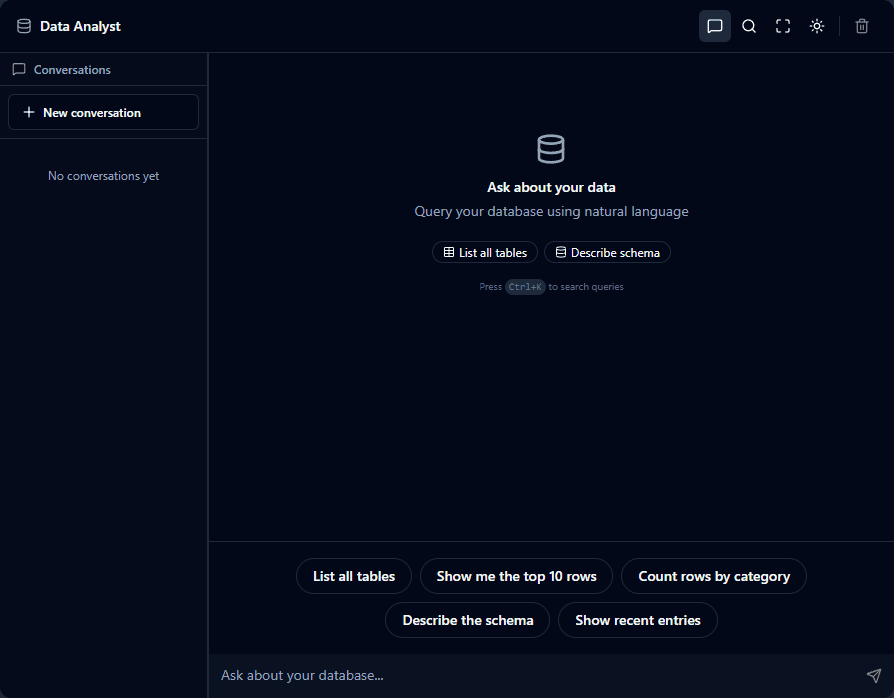
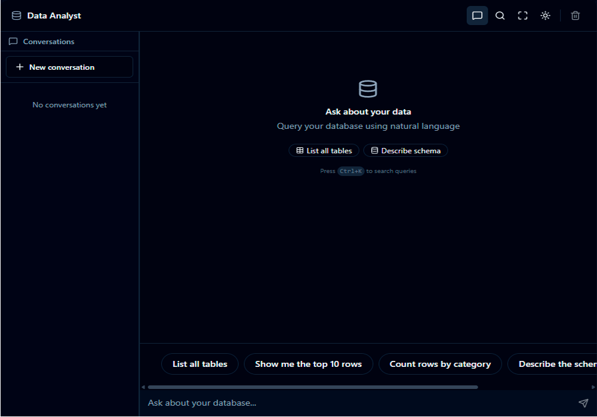

# Chat Data Analyst

A conversational data analyst agent that translates natural language questions into SQL queries and returns structured insights — streamed in real time through a chat interface.

Built on top of a [Pagila](https://github.com/devrimgunduz/pagila) PostgreSQL database, simulating a DVD rental business.

---



---

## Screenshots

| Empty UI | Query result |
|---|---|
|  |  |

---

## What it does

- Ask questions in plain English about the rental business
- The agent inspects the database schema, writes a SELECT query, executes it, and returns the result as a markdown table
- Every response includes the SQL used — the reasoning is fully transparent
- Responses stream token by token as they are generated

---

## How it works

```
User question
     │
     ▼
Next.js API route (POST /api/chat)
     │
     ▼
Mastra Agent  ──► getSchema        reads information_schema, 5-min TTL cache
               ──► getTableSample  up to 20 sample rows, whitelist-guarded
               ──► executeQuery    SELECT-only, 10s timeout, markdown output
     │
     ▼
Streamed response (Vercel AI SDK)
     │
     ▼
React chat UI
```

The agent follows a strict tool-call sequence on every turn:

1. **Step 0 — Schema fetch** — always called first, never skipped
2. **Step 1+ — Query execution** — writes and runs a SELECT query against the live database
3. **Final step — Text response** — formats results as a markdown table with a plain-English insight

---

## Agent design decisions

| Decision | Why |
|---|---|
| **Temperature 0** | Deterministic SQL generation — same question always produces the same query |
| **7 input processors** | Control the agent's behavior at each step without fine-tuning the model |
| **ForceFirstToolCall** | Prevents the model from hallucinating schema from training data |
| **BlockSchemaRepeat** | Stops the agent from re-fetching schema on every step |
| **AnchorCurrentQuestion** | Re-injects the user's question at every step to prevent context drift across tool calls |
| **EmptyResultEarlyStop** | If a query returns no rows, hints the agent to simplify before giving up |
| **EnsureFinalResponse** | Forces a text response on the last step — the agent never returns empty |
| **ToolCallFilter** | Strips schema blobs and sample rows from history after step 0 to save tokens |
| **TokenLimiter** | Hard cap on message history to fit the model's context window |
| **Read-only guard** | `executeQuery` rejects any non-SELECT statement at the application layer |

---

## Tech stack

| Layer | Technology |
|---|---|
| Frontend | Next.js 15, React 19, Tailwind CSS 4, Shadcn UI / Radix UI |
| AI framework | Mastra (`@mastra/core`, `@mastra/memory`, `@mastra/ai-sdk`) |
| Model | Local LLM via LM Studio (OpenAI-compatible API) |
| Database | PostgreSQL — Pagila sample dataset |
| Storage | LibSQL for conversation memory and observability traces |
| Streaming | Vercel AI SDK (`useChat` + streaming response) |

---

## Demo query

The GIF above shows the following question asked to the agent:

> *Who are the top 10 customers by total amount spent?*

The agent fetches the schema, writes a JOIN query across `customer`, `payment`, and `address`, and streams back the ranked table with a plain-English summary.

---

> The source code for this project is private.
